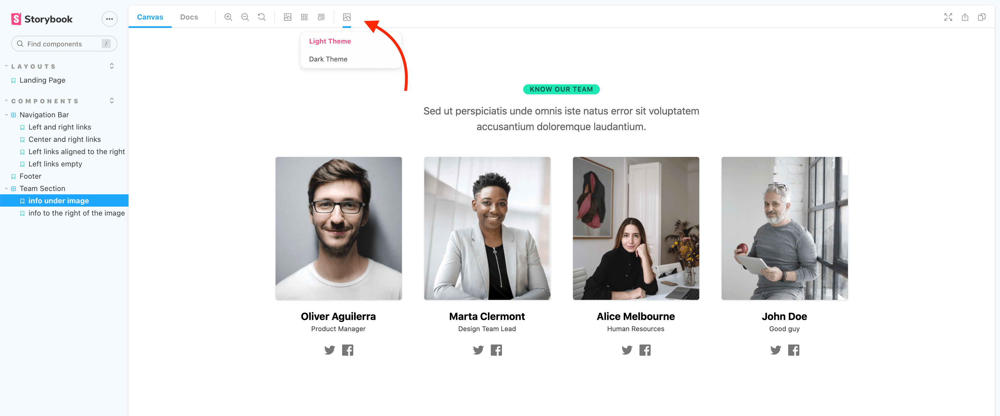
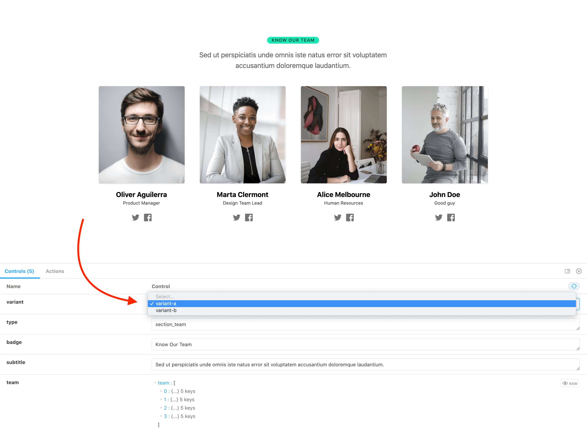

# Stackbit Components Library


## Develop locally

1. Clone the repo
1. run `npm install`
1. run `npm run develop` or `npm run develop-watch-themes` to watch for `themes/tailwind.{theme_name}.config.js` files and rebuild them.
1. Navigate to http://localhost:6006/ to open Storybook


## Themes

Every component can be rendered with a different theme. To change a theme in Storybook, click on the toolbar button with the "image" icon:



Every theme has a matching Tailwind config file in the `themes` folder. The configs files have the following format:

```
themes/tailwind.{theme_name}.config.js
```

Where the `{theme_name}` is an ID of a theme.

To build all tailwind configs run:

```shell
npm run build-themes
```

The generated CSS files will be written to `public/css/tailwind.{theme_name}.css`. These CSS files are only used by Storybook. When importing this library from your project, import tailwind config of a particular theme directly and use it as a preset:

```js
// tailwind.config.js
module.exports = {
  presets: [
    require('@stackbit/components/themes/tailwind.classic.config.js')
  ],
  // ...
}
```


## Variants

Some components might have several variants. To switch the variant, change the value of the component property responsible for the variant:




## Building Storybook

To build Storybook run `npm build`, the generated files will be written to `storybook-static` folder.
